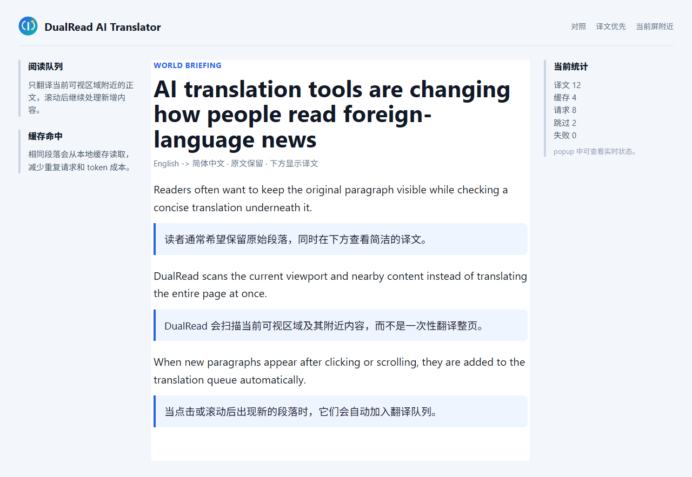
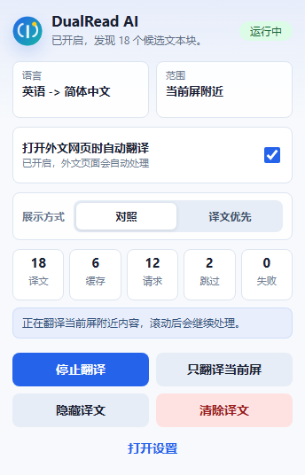

# DualRead AI Translator - AI 网页对照翻译 Chrome 插件

[English](README.md)

DualRead AI Translator 是一个开源 Chrome MV3 AI 网页翻译插件。它保留网页原文，并在附近插入 AI 译文，适合阅读英文新闻、社交媒体、问答页面、技术文档和长文章。

它的定位是轻量的 OpenAI-compatible 网页对照翻译工具：使用你自己的 API Key，选择模型，只翻译当前阅读区域，并尽量控制 token 成本。


## 效果预览





## 为什么使用 DualRead AI Translator

- **网页对照翻译**：原文保留在页面中，译文显示在原文下方。
- **Chrome AI 翻译插件体验**：支持 OpenAI、DeepSeek、DashScope/Qwen、本地模型和自定义 OpenAI-compatible API。
- **可视区域优先**：优先翻译当前屏及附近内容，而不是默认发送整页文本。
- **动态页面支持**：支持滚动信息流、展开正文、延迟加载内容和长文章。
- **结构感知排版**：自动适配块布局、Flex、Grid、裁剪预览、列表和 Web Component，避免译文挤压或穿插原文。
- **自动翻译并跳过目标语言页面**：外文页面自动翻译，已以目标语言为主的页面自动跳过。
- **右键翻译**：可翻译当前网页，也可只翻译选中文本。
- **快速且控制 token 成本**：逐段纯文本流式输出、小并发、每页预算和本地段落缓存。
- **隐私边界清晰**：没有项目自有服务器，没有统计分析，没有内置开发者 API Key。

## 适合场景

DualRead 适合：

- 阅读英文新闻网站，并在原文下方查看简体中文译文。
- 翻译 X/Twitter 帖子、Reddit 讨论、Quora 回答和论坛页面。
- 阅读技术文档、GitHub README、Wikipedia 文章和技术博客。
- 学习语言时对照查看原文段落和译文段落。

默认翻译方向：英语 -> 简体中文。扩展 UI 支持简体中文、繁體中文、英语和日语。

## 安装

1. 打开 `chrome://extensions/`。
2. 开启 **开发者模式**。
3. 点击 **加载已解压的扩展程序**。
4. 选择 `dualread-ai-translator` 目录。
5. 修改代码后，在扩展卡片点击刷新，并重新加载目标网页。

## 配置

打开插件弹窗，点击 **打开设置**，然后配置：

```text
服务商：OpenAI / DeepSeek / DashScope / 本地兼容服务 / 自定义
API Key：你自己的服务商密钥
模型：例如 gpt-4o-mini 或 deepseek-chat
API 地址：OpenAI-compatible Chat Completions 接口
```

常见 API 地址：

```text
OpenAI    https://api.openai.com/v1/chat/completions
DeepSeek  https://api.deepseek.com/v1/chat/completions
DashScope https://dashscope.aliyuncs.com/compatible-mode/v1/chat/completions
本地服务  http://localhost:8000/v1/chat/completions
```

设置会自动保存。本项目不内置、也不需要任何开发者自己的 API Key。

界面语言与翻译语言相互独立。你可以让插件界面保持英文，同时继续英译中、日译繁中，或使用服务商支持的其他翻译方向。

强烈建议在 **高级连接设置** 中保持 **自动关闭可控思考模式** 开启。思考 / 推理模式会让每个翻译批次明显变慢。默认的 **自动选择** 会根据 API 地址和模型名称选择常见服务商参数，包括 `enable_thinking: false`、`thinking: { type: "disabled" }`、OpenRouter reasoning 控制参数，以及本地 Qwen 的 `chat_template_kwargs`。

## 使用

- **开始翻译**：翻译当前可见区域及附近正文。
- **只翻译当前屏**：限制扫描当前视口附近内容。
- **隐藏 / 显示译文**：临时切换译文和原文视图。
- **清除译文**：移除当前页面已插入的译文。
- **右键页面**：翻译当前页面。
- **右键选中文本**：只翻译选中的文本。

网页翻译会先判断页面整体语言。页面已是目标语言时会跳过；否则会翻译当前可视区域及附近的可读文本，包括较短的标题和模块标签。少量混排外文仍可用选中文本右键翻译。

## 常见问题

### DualRead 会翻译整个网页吗？

默认不会。DualRead 优先处理当前可视区域及附近内容，以减少 API 请求和 token 成本。

### 支持哪些 AI 服务商？

任何 OpenAI-compatible Chat Completions API 都可以使用。内置预设包括 OpenAI、DeepSeek、DashScope/Qwen、本地兼容服务和自定义接口。

### 可以关闭模型思考模式吗？

可以，而且为了翻译速度强烈建议开启。保持 **强烈推荐开启：自动关闭可控思考模式** 开启，并优先使用 **自动选择**。自动模式覆盖 DashScope/Qwen、DeepSeek-like 模型、OpenRouter 和本地 Qwen-compatible 服务。如果服务商拒绝某个思考参数，DualRead 会自动去掉该参数并重试一次。

### API Key 保存在哪里？

API Key 只保存在本机 Chrome 扩展存储中，不会发送到项目自有服务器。

### UI 语言可以和目标翻译语言不同吗？

可以。界面语言独立于源语言和目标语言；扩展 UI 已包含简体中文、繁體中文、英语和日语。

## 隐私

- API Key、设置和翻译缓存只保存在本机 Chrome 扩展存储中。
- 网页文本只会发送到用户自己配置的 API 地址。
- 扩展没有项目自有服务器，也没有内置统计分析。
- 不要把真实 API Key 粘贴到 issue、截图或公开 bug 报告中。

更多说明见 [PRIVACY.md](PRIVACY.md)。

## 开发

```bash
npm install
npm run check
npm test
npm run test:samples
```

常用脚本：

```bash
npm run audit:public        # 扫描可发布文件中的密钥、本地路径和不安全产物
node scripts/generate-locales.js
```

开发说明见 [docs/development.md](docs/development.md)。手工测试页面见 [test-pages.md](test-pages.md)。

## 开源发布检查

分享或发布前：

1. 运行 `npm run check`。
2. 确认截图不包含 API Key、账号或私人页面。
3. 确认没有提交 `.env`、`.npmrc`、压缩包、CRX 文件和私钥。
4. 如果要发布 Git 历史，先检查提交作者姓名和邮箱。

## 关键词

Chrome 翻译插件、AI 网页翻译、网页对照翻译、双语网页翻译、OpenAI-compatible 翻译、DeepSeek 翻译、Qwen 翻译、英译中网页翻译。

## 链接

- [English README](README.md)
- [隐私说明](PRIVACY.md)
- [贡献说明](CONTRIBUTING.md)
- [更新日志](CHANGELOG.md)
- [许可证](LICENSE)
